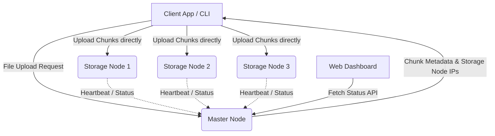

# Project Report: Distributed File System (DFS)

## 1. Project Overview
In today's data-driven environments, centralized file systems face critical limitations such as single points of failure, scalability bottlenecks, and poor availability. This project introduces a robust, fault-tolerant **Distributed File System (DFS)** designed to overcome these challenges. By intelligently distributing data across a network of interconnected nodes, the system ensures data redundancy, high availability, and seamless scalability, effectively aggregating the capacity of multiple inexpensive commodity machines while guaranteeing continuous operation.

## 2. Module-Wise Breakdown
- **Master Node (Name Node):** Acts as the central coordinator. It handles metadata management, tracks which chunks are stored on which nodes, monitors the health of storage nodes through heartbeats, and orchestrates replication and recovery processes.
- **Storage Nodes (Data Nodes):** These are the independent machines that physically store the file chunks. In this architecture, they process read/write operations proxy-forwarded by the Master Node and their health is continuously monitored via a simulated heartbeat system.
- **REST API Backend:** A robust backend built with Flask that serves as the gateway for all client interactions. It supports operations like file upload, download, and cluster management by abstracting the complexities of distributed storage via standard HTTP endpoints.
- **Web Dashboard:** A modern, interactive frontend interface featuring a premium glassmorphism-inspired UI. It provides administrators with real-time visualization of cluster health, storage utilization, and node activity.

## 3. Functionalities
- **Automated File Chunking:** When a file is uploaded, the system automatically splits it into smaller, fixed-size data blocks (chunks), allowing it to store files larger than any single node's capacity.
- **Data Replication & Fault Tolerance:** Every chunk is securely replicated and stored across multiple independent storage nodes based on a configurable replication factor. If a node fails, data remains accessible from the replicas.
- **Active Health Monitoring (Heartbeats):** The Master Node continuously monitors the health and availability of all connected storage nodes through periodic heartbeat signals.
- **Self-Healing and Automatic Recovery:** If a storage node stops sending heartbeats, the Master Node automatically detects the failure, identifies under-replicated chunks, and initiates a re-replication process to healthy nodes.
- **Premium Web Dashboard:** Real-time visual monitoring of the distributed system to simplify administration and provide system insights.

## 4. Technology Used
- **Programming Languages:** Python (Backend core logic), HTML, CSS, JavaScript (Frontend dashboard).
- **Libraries and Tools:** Flask (for serving the backend API), Flask-CORS (for handling Cross-Origin Resource Sharing).
- **Other Tools:** Git and GitHub for version control and revision tracking.

## 5. Flow Diagram

## 6. Revision Tracking on GitHub
- **Repository Name:** AnkitRaj027/DistributedFileSystem
- **GitHub Link:** [https://github.com/AnkitRaj027/DistributedFileSystem](https://github.com/AnkitRaj027/DistributedFileSystem)

## 7. Conclusion and Future Scope
### Conclusion
The Distributed File System successfully transforms a collection of ordinary computers into a highly reliable, fault-tolerant, and scalable storage infrastructure. By implementing intelligent file chunking, strategic replication, and continuous self-healing mechanisms, it effectively mitigates the vulnerabilities of centralized data storage, ensuring that data is always available and safe from single-node failures.

### Future Scope
- **Data Encryption:** Implementing robust encryption algorithms for data at rest and in transit to enhance security.
- **Dynamic Load Balancing:** Optimizing the distribution of chunks based on node capacity and network bandwidth.
- **Geo-Replication:** Expanding the system to support nodes across different geographical regions to protect against entire data center failures.
- **Advanced Authentication:** Adding user authentication and access control policies for multi-tenant environments.

## 8. References
1. **Google File System (GFS):** Ghemawat, S., Gobioff, H., & Leung, S. T. (2003). "The Google file system". *Proceedings of the 19th ACM Symposium on Operating Systems Principles*.
2. **Hadoop Distributed File System (HDFS):** Shvachko, K., Kuang, H., Radia, S., & Chansler, R. (2010). "The Hadoop Distributed File System". *IEEE 26th Symposium on Mass Storage Systems and Technologies (MSST)*.
3. **Distributed Systems Principles:** Coulouris, G., Dollimore, J., Kindberg, T., & Blair, G. (2011). *Distributed Systems: Concepts and Design* (5th Edition). Addison-Wesley.
4. **Flask Documentation:** Pallets Projects. *Flask: A Python Microframework*. https://flask.palletsprojects.com/
5. **MDN Web Docs:** Mozilla. *Modern HTML, CSS, and JavaScript*. https://developer.mozilla.org/

---

# Appendix

## A. AI-Generated Project Elaboration/Breakdown Report

This distributed file system represents a modern approach to overcoming traditional monolithic storage constraints. 

**Architectural Paradigm:**
The project follows a Master-Worker architecture model. The Master Node retains the namespace tree and the mapping of file blocks to Storage Nodes. Storage Nodes handle read and write requests from the file system's clients, and also perform block creation, deletion, and replication upon instruction from the Master Node.

**Fault Tolerance Strategy:**
The system is designed with the assumption that hardware failure is the norm rather than the exception. By utilizing a Heartbeat mechanism, the Master node can quickly identify "dead" nodes. The chunk replication factor (e.g., storing 3 copies of every chunk) ensures that a single node going down does not lead to data loss. The automatic self-healing process ensures the system returns to its desired state (target replication factor) without human intervention.

**Dashboard Integration:**
The integration of a dashboard via Flask provides a real-time window into the system's operational state, an essential feature for managing distributed infrastructures. 

## B. Problem Statement

In today's data-driven environments, individuals and organizations generate, process, and store massive amounts of information. Traditional centralized file systems—where all data resides on a single physical machine or server—face critical limitations that hinder reliability and growth:

1. **Single Point of Failure**: Centralized systems are inherently fragile. If the core storage server experiences a hardware malfunction, disk corruption, or network disconnection, all data becomes completely inaccessible or is permanently lost.
2. **Scalability Bottlenecks**: A single machine possesses finite storage capacity and I/O throughput. Scaling vertically (upgrading disks, RAM, or CPUs on a single server) is prohibitively expensive and eventually hits hard physical limits.
3. **Poor Availability**: Routine maintenance, software updates, or sudden crashes of a central server inevitably lead to system downtime. During these periods, critical data is unavailable to users and dependent applications, disrupting workflows.

There is a pressing need for a robust, resilient storage architecture capable of aggregating the capacity of multiple inexpensive commodity machines while simultaneously guaranteeing data integrity, high availability, and continuous operation—even in the face of inevitable hardware failures.

## C. Solution/Code
This project introduces a robust, fault-tolerant Distributed File System (DFS) designed to overcome the critical limitations of centralized storage. 

**Backend Code Setup (app.py & dfs_core.py):**
The core functionality is encapsulated in Python scripts. `dfs_core.py` contains the logic for chunking files, managing nodes, handling replication, and processing heartbeats. `app.py` exposes this functionality via a REST API using Flask, allowing both the frontend dashboard and external clients to interact with the system.

**Frontend Code Setup (index.html, style.css, script.js):**
A beautifully designed web interface using HTML, modern CSS, and JavaScript. It communicates with the Flask backend to visualize node status, active files, and overall system health.
